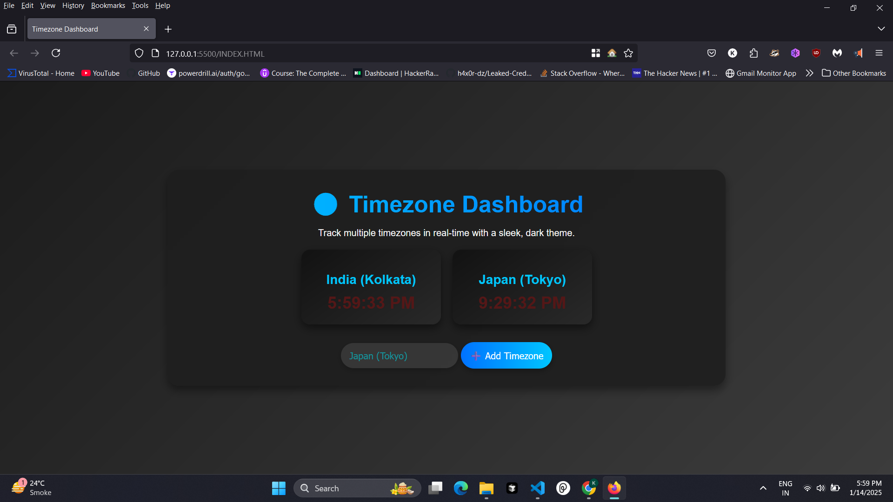

# 🌍 Timezone Dashboard &nbsp;  

> Track multiple timezones with a sleek, dark theme.

## 🚀 Features

- Real-time clock updates ⏰
- Animated transitions ✨
- Dark theme design 🌑

## 🏗️ Installation

1. Clone or download this repo.
2. Launch `index.html` in your favorite browser.

## 🎨 Usage

1. Pick a timezone from the dropdown.
2. Click “➕ Add Timezone” to display a new clock card.

## ⚙️ Technology

-  for structure
-  for styling
-  for dynamic updates

## 🤝 Contributing

Pull requests are welcome. For major changes, open an issue first.

## 📜 License

MIT License

Stay on time, everywhere!
